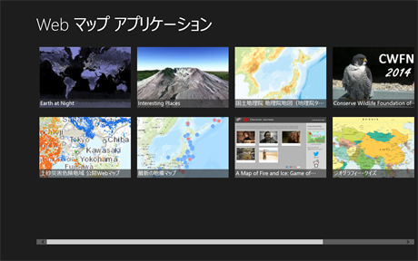
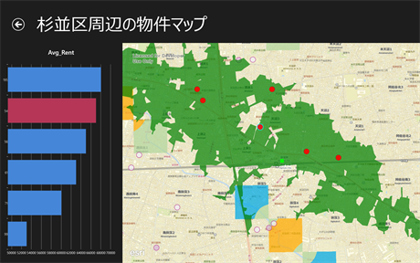

# webmap-startup-template-dotnet

Web マップを使用した開発手法を伝えるためのサンプル アプリケーションです。

ArcGIS Online に公開されている Web マップを読み込み任意のレイヤに対して以下の処理を実行します。
* 任意の属性フィールドを使用した属性フィルタ
* 到達圏解析結果による空間検索
* 空間検索結果のグラフ表示

## 使用している製品・プロジェクト

* [ArcGIS Runtime SDK for .NET](https://developers.arcgis.com/net/)
* [ArcGIS for Developers](https://developers.arcgis.com/en/)
* [WinRT XAML Toolkit](https://winrtxamltoolkit.codeplex.com/)

**ArcGIS の開発キットを使用して開発を行う場合は ArcGIS Online 開発者アカウント（[ArcGIS for Developers](https://developers.arcgis.com/en/)）が必要です。開発者アカウントは無償で作成することができます。作成方法は[こちら](http://www.esrij.com/cgi-bin/wp/wp-content/uploads/documents/signup-esri-developers.pdf)**

※到達圏解析は開発者アカウントでのサインインが必要です。解析を一度実行するごとに 0.5 クレジットを消費します。クレジットの詳細は[こちら](http://www.esrij.com/products/arcgis-online-for-developers/details/plans/)をご参照ください。

## 動作環境
###OS
* Windows 8.1

###開発環境
* Microsoft Visual Studio 2013
* Microsoft Visual Studio Express 2013 for Windows

## リソース

* [GeoNet開発者コミュニティ サイト](https://geonet.esri.com/groups/devcom-jp)
* [ArcGIS Runtime SDK for .NET(ESRIジャパン)](http://www.esrij.com/products/arcgis-runtime-sdk-for-dotnet/)
* [ArcGIS Runtime SDK for .NET リファレンス](https://developers.arcgis.com/net/desktop/api-reference/)

##制限事項
既知の問題により、ソリューションを正しくデバッグ実行するには、ソリューションのクローンもしくはダウンロード先のディレクトリパスに日本語などの 2 バイト文字を含めないでください（※ ArcGIS Runtime SDK for .NET を別途ご使用のマシンにインストールする場合は、この制限事項は適用されません）。

## ライセンス
Copyright 2015 Esri Japan Corporation.

Apache License Version 2.0（「本ライセンス」）に基づいてライセンスされます。あなたがこのファイルを使用するためには、本ライセンスに従わなければなりません。本ライセンスのコピーは下記の場所から入手できます。

> http://www.apache.org/licenses/LICENSE-2.0

適用される法律または書面での同意によって命じられない限り、本ライセンスに基づいて頒布されるソフトウェアは、明示黙示を問わず、いかなる保証も条件もなしに「現状のまま」頒布されます。本ライセンスでの権利と制限を規定した文言については、本ライセンスを参照してください。

ライセンスのコピーは本リポジトリの[ライセンス ファイル](./LICENSE)で利用可能です。

